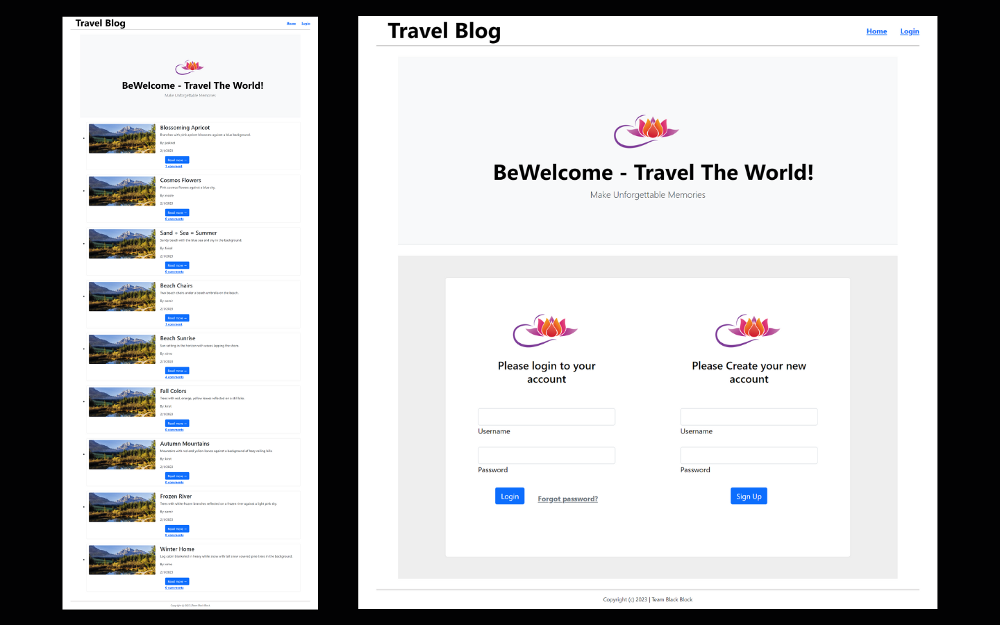

# Travel Blog
        
## 🌟[Description](#table-of-contents)
Travel blog is an online travel journal complete with travel stories, photographs and video that document travelers’ experiences and enables them to share those experiences  with friends and family members, other travelers and even strangers they meet online.


<p>
    
    
    
    
    
    
    
</p>

## Table-of-Contents
* [Description](#description)
* [Submission](#User-Stor)
* [Mock-Up](#Mock-Up)
* [Installation](#installation)
* [License](#License)
* [Contributing](#contributing)
* [FAQs](#faqs)
  
## 🚀 [Submission](#table-of-contents)

Deployed app: https://jazzykr29.herokuapp.com/
Github Page: https://github.com/JASKIRAT29/Travel-Blog


## 📺 [Mock-Up](#table-of-contents)




## [Video Link](https://drive.google.com/file/d/1kXB8-2jWPZahupvLzWqKF7fFX2_MxTN4/view?usp=share_link)

## ⚙️ [Installation](#table-of-contents)
Use your terminal to clone or download or copy the zip file to a directory of your choice. Then open the file in VS Code or whatever editor you use. In VS Code, open the terminal and navigate to e-commerce-back-end in the root directory. 
``` 
npm i
``` 
Run the following command at the root of your project and answer the prompted questions:
``` 
mysql -u root -p
``` 
Enter PW when promted
``` 
source db/schema.sql
quit
npm run seed
npm start
```        
## 📑 [License](#table-of-contents)


Your repository is licensed under an mit open source license, so other people can contribute more easily.More information can be found by clicking this [link.](https://choosealicense.com/licenses/mit)

## 🤝 [Contributing](#table-of-contents)
We are open to all kinds of contributions. If you want to:
* 🤔 Suggest a feature
* 🐛 Report an issue
* 📖 Improve documentation
* 👨‍💻 Contribute to the code

We are excited that you are reading this and are willing to contribute. No need to think big. Even a typo fix might save our day and make you a hero. Every contribution counts!
     
Feel free to check [issues page](https://github.com/VimukthiGunasekara/e-commerce-back-end/issues) 
     
## 🤔 [FAQs](#table-of-contents)
Please contact me using the following links:

[Semir Seper](https://github.com/seper56)
<br>
[Jaskirat Kaur](https://github.com/JASKIRAT29)
<br>
[Vimukthi Gunasekara](https://github.com/VimukthiGunasekara)


